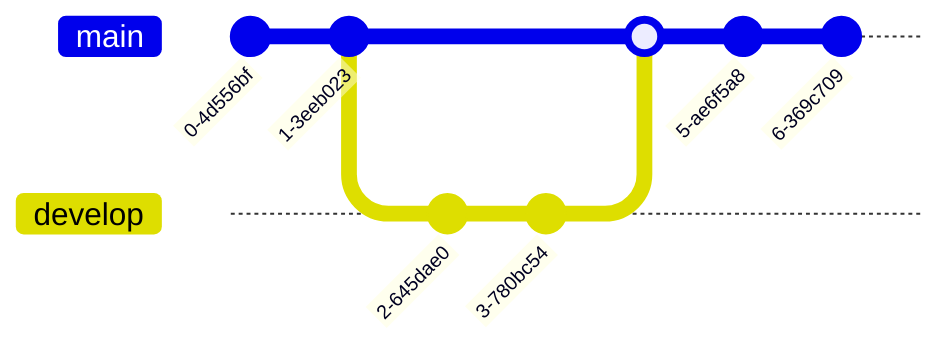

+=+=+=+
title: testing page for demonstrating a portion of markdown functions which utilize react hooks
date: "2024-02-19 14:26:02"
exeCPP: false
exePYTHON: false
abstract: ""
done: true
+=+=+=+

# Contents


# Mermaid





# Text gallery

```js run p5
function sketch(p5) {
    const isDarkTheme = false;
    var myCanvas;
    let input, button, slider, greeting;
    var xPos = 0;
    var textWidth = 0;

    p5.setup = () => {
        // create canvas
        const container = document.getElementsByTagName("article")[0];
        // console.log(container);
        // console.log(container.offsetHeight);
        // console.log(container.offsetWidth);
        myCanvas = p5.createCanvas(container.offsetWidth, 400);
        // p5.createCanvas(710, 400);

        input = p5.createInput();
        input.position(0, 10, "relative");
        input.addClass("input");
        input.addClass("input-bordered");
        input.addClass("w-full");
        input.addClass("max-w-xs");
        input.attribute("placeholder", "Type in display string");

        button = p5.createButton("submit");
        button.position(input.x + 10, 10, "relative");
        button.mousePressed(greet);

        // greeting = p5.createElement("p", "Enter text");
        // greeting.position(0, 5, "relative");

        slider = p5.createSlider(0, 100);
        slider.position(20, 10, "relative");
        slider.value(2);

        if (isDarkTheme) {
            p5.background(100);
            p5.fill(200);
        } else {
            p5.background(200);
            p5.fill(0);
        }

        p5.textAlign(p5.LEFT);
        p5.textSize(50);
        // p5.color
        // fill('cornflowerblue');
    };

    var name = "";

    p5.draw = () => {
        // name = input.value();
        if (isDarkTheme) {
            p5.background(100);
            p5.fill(200);
        } else {
            p5.background(200);
            p5.fill(0);
        }
        p5.text(name, p5.width - xPos, p5.height / 2);
        xPos = (xPos + 1 * slider.value()) % (textWidth + p5.width);
    };

    greet = () => {
        name = input.value();
        textWidth = p5.textWidth(name);
        xPos = 0;
        input.value("");
    };

    p5.touchStarted = () => {
        // if (p5.mouseX > 0 && p5.mouseX < p5.width && p5.mouseY > 0 && p5.mouseY < p5.height) {
        //     let fs = p5.fullscreen();
        //     p5.fullscreen(!fs);
        // }
        // return false;
    };

    p5.windowResized = () => {
        const container = document.getElementsByTagName("article")[0];
        // console.log(container);
        // console.log(container.offsetHeight);
        // console.log(container.offsetWidth);
        if (p5.fullscreen()) {
            p5.resizeCanvas(p5.windowWidth, p5.windowHeight);
            document.body.style.overflow = "hidden"; // <-- relevant addition
            //   myCanvas.style('position', 'absolute');
            //   myCanvas.style('display', 'block');
            //   ^^^^ this does not work
        } else {
            p5.resizeCanvas(container.offsetWidth, 400);
            document.body.style.overflow = "visible"; // <-- toggle back to normal mode
        }
    };
    // p5.draw = () => {
    //     p5.background(255);
    //     p5.fill("pink");
    //     p5.noStroke();
    //     p5.circle(p5.width / 2, p5.height / 2, 7);
    // };
}
```

# Gallery

```yaml run gallery
- original: "https://picsum.photos/id/1018/1000/600/"
- original: "https://picsum.photos/id/1015/1000/600/"
- original: "https://picsum.photos/id/1019/1000/600/"
```

# Chart

Haven't thought of a way of using it. Will add this to the markdown renderer but leave it empty for now.

```tsx
<ChartRender></ChartRender>
```

# P5 graphics

```js run p5
function sketch(p5) {
    const isDarkTheme = false;
    p5.setup = () => {
        p5.createCanvas(300, 100, p5.WEBGL);
    };
    p5.draw = () => {
        if (isDarkTheme) {
            p5.background(100);
        } else {
            p5.background(250);
        }
        p5.normalMaterial();
        p5.strokeWeight(4);
        p5.stroke(51);
        p5.push();
        p5.rotateZ(p5.frameCount * 0.01);
        p5.plane(100);
        p5.pop();
        p5.circle(p5.mouseX - p5.width / 2, p5.mouseY - p5.height / 2, 5);
    };
}
```

```js p5
// js run p5
function sketch(p5) {
    const isDarkTheme = false;
    p5.setup = () => {
        p5.createCanvas(300, 100, p5.WEBGL);
        p5.stroke(51);
    };
    p5.draw = () => {
        if (isDarkTheme) {
            p5.background(100);
        } else {
            p5.background(250);
        }
        p5.normalMaterial();
        p5.strokeWeight(4);
        p5.circle(p5.mouseX - p5.width / 2, p5.mouseY - p5.height / 2, 5);
        p5.push();
        p5.rotateZ(p5.frameCount * 0.01);
        p5.plane(100);
        p5.pop();
    };
}
```

```js run p5 fullWidth
function sketch(p5) {
    const isDarkTheme = false;

    p5.setup = () => {
        const container = document.getElementsByTagName("body")[0];
        p5.createCanvas(container.offsetWidth, 100, p5.WEBGL);
        // p5.createCanvas(p5.displayWidth, 100, p5.WEBGL);
        // console.log(p5.width);
        // console.log(p5.windowWidth);
    };
    p5.draw = () => {
        if (isDarkTheme) {
            p5.background(100);
        } else {
            p5.background(250);
        }
        p5.normalMaterial();
        p5.strokeWeight(4);
        p5.stroke(51);
        p5.push();
        p5.rotateZ(p5.frameCount * 0.01);
        p5.plane(100);
        p5.pop();
        p5.circle(p5.mouseX - p5.width / 2, p5.mouseY - p5.height / 2, 5);
    };

    p5.windowResized = () => {
        const container = document.getElementsByTagName("body")[0];
        p5.resizeCanvas(container.offsetWidth, p5.height);
    };
}
```

```js run p5 fullWidth
function sketch(p5) {
    const isDarkTheme = false;

    p5.setup = () => {
        const container = document.getElementsByTagName("body")[0];
        p5.createCanvas(container.offsetWidth, 100, p5.WEBGL);
    };
    p5.draw = () => {
        if (isDarkTheme) {
            p5.background(100);
        } else {
            p5.background(200);
        }
        p5.normalMaterial();
        p5.strokeWeight(4);
        p5.stroke(51);
        p5.push();
        p5.rotateZ(p5.frameCount * 0.01);
        p5.plane(100);
        p5.pop();
        p5.circle(p5.mouseX - p5.width / 2, p5.mouseY - p5.height / 2, 5);
    };

    p5.windowResized = () => {
        const container = document.getElementsByTagName("body")[0];
        p5.resizeCanvas(container.offsetWidth, p5.height);
    };
}
```

```js run p5 fullWidth
function sketch(p5) {
    const isDarkTheme = false;

    p5.setup = () => {
        const container = document.getElementsByTagName("body")[0];
        p5.createCanvas(container.offsetWidth, 100);
        if (isDarkTheme) {
            p5.background("pink");
        } else {
            p5.background("skyblue");
        }
        p5.fill("orange");
        p5.noStroke();
        p5.circle(p5.width / 2, p5.height / 2, 7);
    };
    p5.windowResized = () => {
        const container = document.getElementsByTagName("body")[0];
        p5.resizeCanvas(container.offsetWidth, p5.height);
    };
    p5.draw = () => {
        if (isDarkTheme) {
            p5.background("pink");
        } else {
            p5.background("skyblue");
        }
        p5.fill("orange");
        p5.noStroke();
        p5.circle(p5.width / 2, p5.height / 2, 7);
    };
}
```

```js run p5 align="left"
function sketch(p5) {
    p5.setup = () => {
        p5.createCanvas(p5.width, 100);
        p5.background(255);
        p5.fill("lightgreen");
        p5.noStroke();
        p5.circle(p5.width / 2, p5.height / 2, 7);
    };
    p5.windowResized = () => {
        p5.resizeCanvas(p5.width, p5.height);
    };
    p5.draw = () => {
        p5.background(255);
        p5.fill("lightgreen");
        p5.noStroke();
        p5.circle(p5.width / 2, p5.height / 2, 7);
    };
}
```

```js run p5 align="right"
function sketch(p5) {
    p5.setup = () => {
        p5.createCanvas(p5.width, 100);
        p5.background(255);
        p5.fill("orange");
        p5.noStroke();
        p5.circle(p5.width / 2, p5.height / 2, 7);
    };
    p5.windowResized = () => {
        p5.resizeCanvas(p5.width, p5.height);
    };
    p5.draw = () => {
        p5.background(255);
        p5.fill("orange");
        p5.noStroke();
        p5.circle(p5.width / 2, p5.height / 2, 7);
    };
}
```

```js run p5
function sketch(p5) {
    p5.setup = () => {
        p5.createCanvas(p5.width, 100);
        p5.background(255);
        p5.fill("pink");
        p5.noStroke();
        p5.circle(p5.width / 2, p5.height / 2, 7);
    };
    p5.windowResized = () => {
        p5.resizeCanvas(p5.width, p5.height);
    };
    p5.draw = () => {
        p5.background(255);
        p5.fill("pink");
        p5.noStroke();
        p5.circle(p5.width / 2, p5.height / 2, 7);
    };
}
```

=r=the old method to set the canvas width within the container==

```js run p5 fullWidth hidden
function sketch(p5) {
    const isDarkTheme = false;

    p5.setup = () => {
        const container = document.getElementsByTagName("body")[0];
        p5.createCanvas(container.offsetWidth, 100, p5.WEBGL);
        // p5.createCanvas(p5.displayWidth, 100, p5.WEBGL);
        // console.log(p5.width);
        // console.log(p5.windowWidth);
    };
    p5.draw = () => {
        if (isDarkTheme) {
            p5.background(100);
        } else {
            p5.background(250);
        }
        p5.normalMaterial();
        p5.strokeWeight(4);
        p5.stroke(51);
        p5.push();
        p5.rotateZ(p5.frameCount * 0.01);
        p5.plane(100);
        p5.pop();
        p5.circle(p5.mouseX - p5.width / 2, p5.mouseY - p5.height / 2, 5);
    };

    p5.windowResized = () => {
        const container = document.getElementsByTagName("body")[0];
        p5.resizeCanvas(container.offsetWidth, p5.height);
    };
}
```

=r=the updated method to set the canvas width within the container==

```js run p5
function sketch(p5) {
    p5.setup = () => {
        const container = document.getElementsByTagName("article")[0];
        // console.log(container);
        // console.log(container.offsetHeight);
        // console.log(container.offsetWidth);
        p5.createCanvas(container.offsetWidth, 100);
        p5.background(255);
        p5.fill("pink");
        p5.noStroke();
        p5.circle(p5.width / 2, p5.height / 2, 7);
    };
    p5.windowResized = () => {
        const container = document.getElementsByTagName("article")[0];
        // console.log(container);
        // console.log(container.offsetHeight);
        // console.log(container.offsetWidth);
        p5.resizeCanvas(container.offsetWidth, p5.height);
    };
    p5.draw = () => {
        p5.background(255);
        p5.fill("pink");
        p5.noStroke();
        p5.circle(p5.width / 2, p5.height / 2, 7);
    };
}
```

# Animate characters

```yaml run character
type: "Cat"
color: "#FFD882"
mood: "sad"
size: 240
```

```yaml
# yaml run character
type: "Cat"
color: "#FFD882" 
#One of: sad, shocked, happy, blissful, lovestruck, excited, ko
mood: "sad"
size: 240
```
