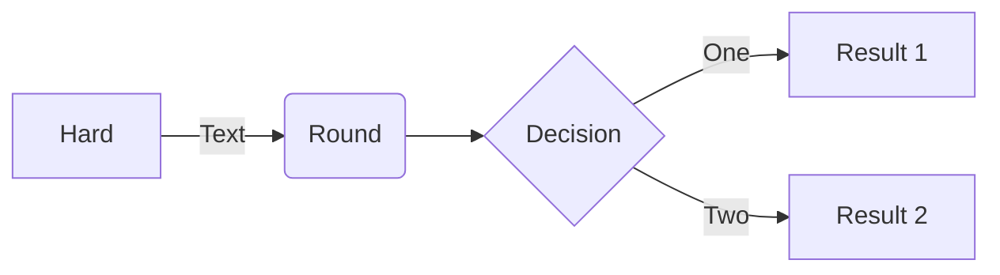
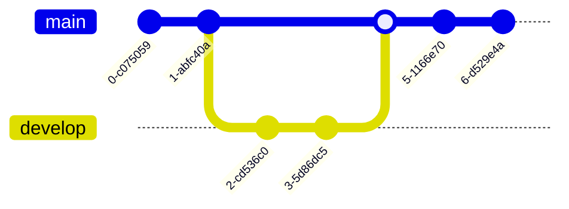
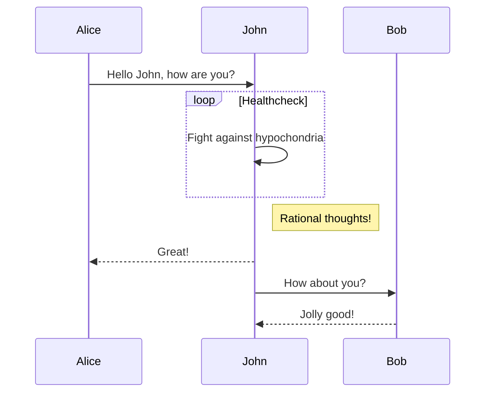
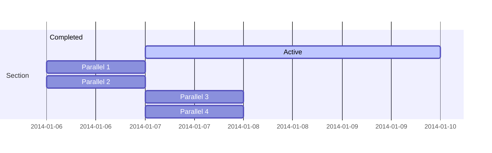
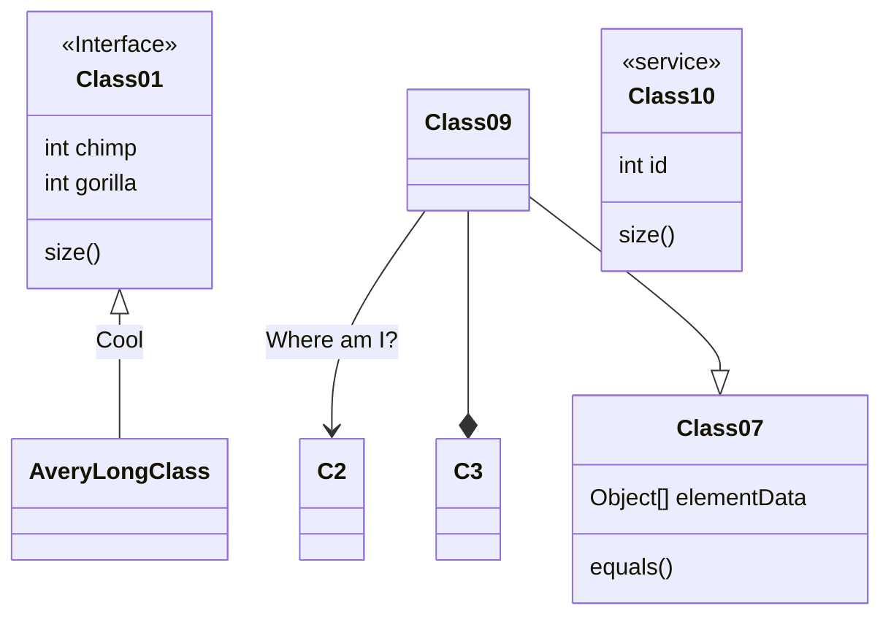
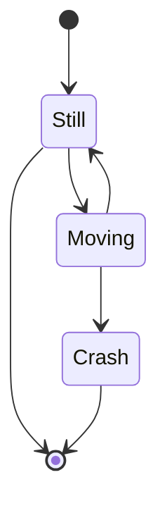
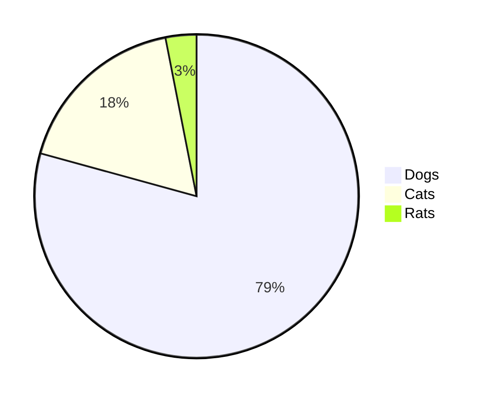
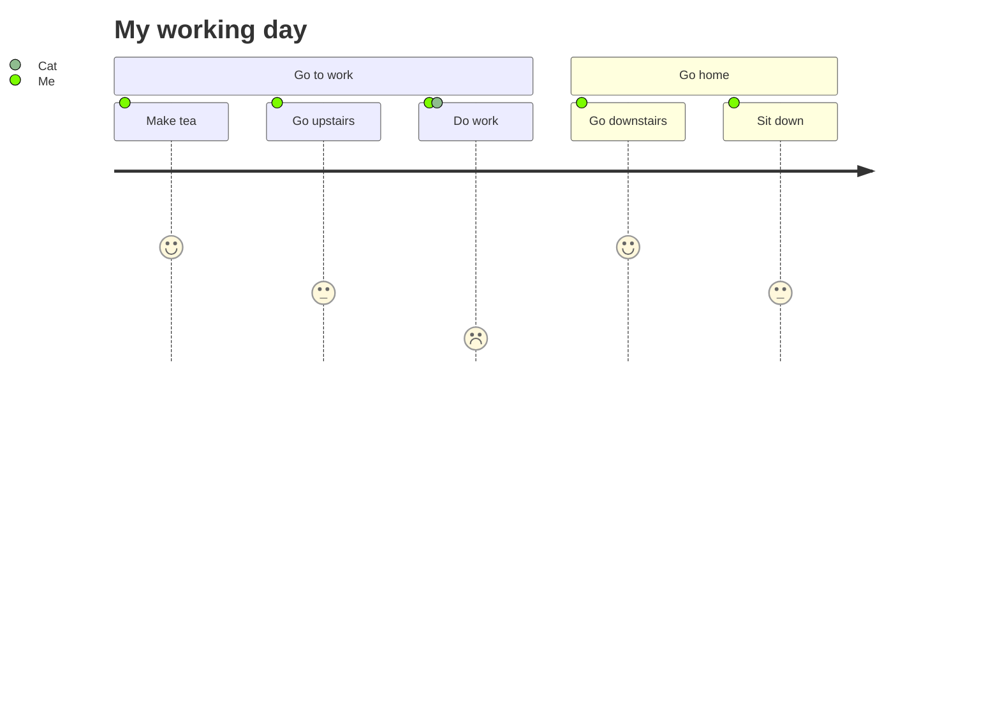
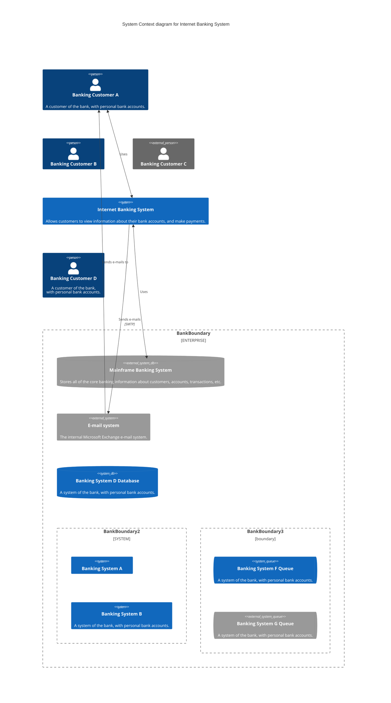

+=+=+=+
title: Testing page for demonstrating ALL markdown functions
date: "2024-02-17 01:31:48"
exeCPP: true
exePYTHON: true
abstract: "This is a very meaningful page since it demonstrated all render effects."
done: true
+=+=+=+

# Contents

# heading test

# h1 Heading

## h2 Heading

### h3 Heading

#### h4 Heading

##### h5 Heading

###### h6 Heading

# Colltest

this is a long testing string for collapse

# Demos

## Long text test

Lorem ipsum dolor sit amet, consectetur adipiscing elit. Sed et nisi ultrices, posuere mi vel, accumsan magna. Nam ut pulvinar nisl. Vestibulum mattis vestibulum nulla, posuere mattis sem posuere a. Curabitur rutrum ut nibh non gravida. Nam convallis nulla quis nisl accumsan, non fringilla elit ultrices. Mauris nec nisi in elit aliquet fringilla. Curabitur metus massa, vestibulum eu placerat in, aliquam id lorem. Nullam nec facilisis ex. Maecenas suscipit velit risus, et gravida quam placerat in. In sed pretium lectus. Cras ornare sed lorem eu eleifend. Cras venenatis enim quis magna pretium commodo. Cras eu dui nec neque imperdiet vestibulum. Ut et laoreet lacus, id pulvinar justo. Vivamus molestie dapibus lacus, non vehicula ex posuere sit amet.

Nam tristique augue ac lacinia mattis. Praesent tristique sagittis lorem nec mattis. Etiam vestibulum sed eros et pretium. Nam non orci nisl. Quisque dignissim dictum diam in feugiat. Aenean scelerisque, nulla tincidunt consequat euismod, magna orci tristique sem, nec posuere magna urna id nibh. Sed semper, mauris sit amet malesuada rhoncus, dolor odio accumsan turpis, quis lobortis orci metus eget nulla. Duis dignissim commodo ligula, in bibendum tellus fermentum ac. Phasellus sit amet mi ac sapien euismod vestibulum. Quisque imperdiet ligula metus, quis dictum erat tristique eu. Maecenas ut purus egestas, placerat tortor vitae, auctor ligula. Ut sodales varius turpis, nec maximus massa porta sit amet. Vestibulum ante ipsum primis in faucibus orci luctus et ultrices posuere cubilia curae; Nulla quis consectetur justo. Vivamus gravida lectus ipsum, quis volutpat nibh sagittis sed. Maecenas ac convallis est.

Donec vitae aliquet nibh. Integer accumsan elit in ante placerat tempus. Vestibulum sem ante, sollicitudin ac ullamcorper malesuada, posuere non purus. Fusce tortor felis, commodo nec dolor ac, consectetur porta sapien. Integer gravida tortor vel lectus rhoncus, bibendum rhoncus nisi gravida. Morbi viverra orci sit amet massa lacinia, vitae pulvinar augue lacinia. Nulla facilisi. Pellentesque eget felis eget nibh rhoncus gravida eu pellentesque sapien. Sed finibus iaculis semper. Nullam id nunc ac neque mattis dictum sit amet sit amet orci. Aliquam volutpat consequat finibus. Pellentesque habitant morbi tristique senectus et netus et malesuada fames ac turpis egestas.

Pellentesque auctor dolor erat, sed iaculis urna viverra id. Praesent orci enim, commodo ac urna vel, sollicitudin pretium magna. Vivamus tincidunt augue hendrerit, auctor dui sed, lobortis dolor. Proin dui metus, commodo et diam in, mattis iaculis tortor. Curabitur sit amet ipsum rhoncus elit blandit ultricies ac in sem. Aenean id porttitor arcu, eget pulvinar est. Vestibulum ac orci non velit porttitor eleifend sed id turpis. Nullam in odio nisi. Aenean vulputate diam vel felis elementum ornare. Donec a aliquet mi. Praesent venenatis massa vitae eros porttitor congue. Curabitur eu tincidunt orci. Cras posuere tristique mi sit amet consequat. Ut et mauris non enim tempus fermentum. Nulla scelerisque risus quis euismod pellentesque. Fusce id euismod ipsum, vel tristique odio.

## Horizontal Rules

---

---

---

## Emphasis

**This is bold text**

**This is bold text**

_This is italic text_

_This is italic text_

~~Strikethrough~~

## Blockquotes

> Blockquotes can also be nested...
>
> > ...by using additional greater-than signs right next to each other...
> >
> > > ...or with spaces between arrows.

## Lists

Unordered

-   Create a list by starting a line with `+`, `-`, or `*`
-   Sub-lists are made by indenting 2 spaces:
    -   Marker character change forces new list start:
        -   Ac tristique libero volutpat at
        *   Facilisis in pretium nisl aliquet
        -   Nulla volutpat aliquam velit
-   Very easy!

Ordered

1. Lorem ipsum dolor sit amet
2. Consectetur adipiscing elit
3. Integer molestie lorem at massa

4. You can use sequential numbers...
5. ...or keep all the numbers as `1.`

Start numbering with offset:

57. foo
1. bar

## Code

Inline `code`

Indented code

    // Some comments
    line 1 of code
    line 2 of code
    line 3 of code

Block code "fences"

```
Sample text here...
```

Syntax highlighting

```js
var foo = function (bar) {
    return bar++;
};

console.log(foo(5));
```

```python
print('testing')
a = 10
b = 20

```

```arduino
// Main program
void setup() {
  // Turn off the LED initially
  digitalWrite(LED_PIN, LOW);
}

void loop() {
  // Check if the button is pressed
  if (digitalRead(BUTTON_PIN) == HIGH) {
    // Generate a random number
    int randomNumber = generateRandomNumber();

    // Blink the LED a random number of times
    blinkLED();

    // Print the random number to the serial monitor
    Serial.println(randomNumber);
  }
}

// End of code.
```

## Tables

| Option | Description                                                               |
| ------ | ------------------------------------------------------------------------- |
| data   | path to data files to supply the data that will be passed into templates. |
| engine | engine to be used for processing templates. Handlebars is the default.    |
| ext    | extension to be used for dest files.                                      |

Right aligned columns

| Option |                                                               Description |
| -----: | ------------------------------------------------------------------------: |
|   data | path to data files to supply the data that will be passed into templates. |
| engine |    engine to be used for processing templates. Handlebars is the default. |
|    ext |                                      extension to be used for dest files. |

## Links

[link text](http://dev.nodeca.com)

[link with title](http://nodeca.github.io/pica/demo/ "title text!")

Autoconverted link https://github.com/nodeca/pica (enable linkify to see)

## Images

```md
/img/IMG_2147.JPG

/img/logo.svg
```

/img/IMG_2147.JPG

/img/logo.svg

```md
https://tailwindcss.com/_next/static/media/tailwindui-small@75.8bb955b2.jpg
```

https://tailwindcss.com/_next/static/media/tailwindui-small@75.8bb955b2.jpg


Like links, Images also have a footnote style syntax

![Alt text][id]

With a reference later in the document defining the URL location:

[id]: https://octodex.github.com/images/dojocat.jpg "The Dojocat"

## Plugins

### Emojies

> Classic markup: :wink: :cry: :laughing: :yum:
>
> Shortcuts (emoticons): :-) :-( 8-) ;)

### Emphasis

Emphasis, aka italics, with _asterisks_ or _underscores_.

Strong emphasis, aka bold, with **asterisks** or **underscores**.

Combined emphasis with **asterisks and _underscores_**.

Strikethrough uses two tildes. ~~Scratch this.~~

### Subscript / Superscript

-   19^th^
-   H~2~O

### \<ins>

++Inserted text++

### \<mark>

**There should not have spaces between `==`**

==Marked text==

=r=Marked text==

=b=Marked text==

```json
{
  a: "amber",
  b: "DeepSkyBlue",
  c: "cyan",
  d: "brown",
  f: "fuchsia",
  g: "green",
  h: "hotpink",
  l: "lime",
  m: "magenta",
  n: "navyblue",
  o: "orange",
  p: "purple",
  q: "pink",
  r: "HotPink",
  s: "silver",
  t: "teal",
  v: "violet",
  w: "white",
  x: "gray",
  y: "yellow",
  z: "black",
}
{
    e: undefined,
    i: undefined,
    j: undefined,
    k: undefined,
    u: undefined,
}
```

### Footnotes

Footnote 1 link[^first].

Footnote 2 link[^second].

Inline footnote^[Text of inline footnote] definition.

Duplicated footnote reference[^second].

[^first]: Footnote **can have markup**

    and multiple paragraphs.

[^second]: Footnote text.

### Definition lists

=r=Render is not fully functional and needs to follow certain rules to get continuous definition working==

```md
Term with _inline markup_

: Definition **1**
```

Term with _inline markup_

: Definition **1**

```md
Lazy Initialization
: Achievement of compactness by not typing an extra line after the definition term.
```

Lazy Initialization
: Achievement of compactness by not typing an extra line after the definition term.

```md
Continuation

: Splitting a single paragraph
across multiple lines.
```

Continuation

: Splitting a single paragraph
across multiple lines.

```md
_This is an example of multiple definitions for a single term_

Indent
: (_noun_) A whitespace to align text in a beautiful way.
: (_verb_) To add whitespace to make ugly code beautiful.
```

Indent
: (_noun_) A whitespace to align text in a beautiful way.
: (_verb_) To add whitespace to make ugly code beautiful.

```md
Multiple declaration
Indent
: (_noun_) A whitespace to align text in a beautiful way.
: (_verb_) To add whitespace to make ugly code beautiful.

Single
: Man without love because `coding is fun`
: Women without love because `they love shopping`.
```

Indent
: (_noun_) A whitespace to align text in a beautiful way.
: (_verb_) To add whitespace to make ugly code beautiful.

Single
: Man without love because `coding is fun`.
: Women without love because `they love shopping`.

### Custom containers

=b=abbr works ~~in note{}~~ every where==

:::note{.alert}
This is an alert
:::

:::note{.info}
This is an info
:::

:::note{.success}
This is a success message
:::

:::note{.warning}
This is a warning
:::

:::note{.error}
This is an error
second line
:abbr[HTML]{title="HyperText Markup Language"}
:::

:::note{.openChat}
Lorem ipsum dolor sit amet, consectetur adipiscing elit. Sed et nisi ultrices, posuere mi vel, accumsan magna. Nam ut pulvinar nisl. Vestibulum mattis vestibulum nulla, posuere mattis sem posuere a. Curabitur rutrum ut nibh non gravida. Nam convallis nulla quis nisl accumsan, non fringilla elit ultrices.
:::

:::note{.closeChat}
Lorem ipsum dolor sit amet, consectetur adipiscing elit. Sed et nisi ultrices, posuere mi vel, accumsan magna. Nam ut pulvinar nisl. Vestibulum mattis vestibulum nulla, posuere mattis sem posuere a. Curabitur rutrum ut nibh non gravida. Nam convallis nulla quis nisl accumsan, non fringilla elit ultrices.
:::

#### Python wrap

---

=y=Wrap the Python code in a customised container==

:::note{.python}
Within note

```python run
# python run
print('test')
```

:::

---

```python
# python
print('test')
```

```python run
# python run
print('test')
```

```python notrun second
# python notrun second
print('test')
```

```python notrun second lib:"lib1",'numpy'
# python notrun second lib:"lib1",'numpy'
print('test')
```

### Python PYODIDE

:::note{.python}

```python rUn lib:["matplotlib",'numpy']
# python rUn lib:["matplotlib",'numpy']
print('test')
```

:::

:::note{.python}

```python run
# python run
import numpy as np
import sys
v = sys.version
add_res = np.add(1.0, 4.0)
x1 = np.arange(9.0).reshape((3, 3))
x2 = np.arange(3.0)
add2_res = np.add(x1, x2)

print(add2_res)
print('multiple line testing')
if (True):
  print('true')
x = 123
print(type(x))
```

:::

```python run monitor
# python run monitor
# matplotlib does not work directly with the dome element. a filtering work arround was implemented in the codeblock
from matplotlib import pyplot as plt
import io
import base64
import js

class Dud:
    def __init__(self, *args, **kwargs) -> None:
        return
    def __getattr__(self, __name: str):
        return Dud
js.document = Dud()

# Create a plot
x1, y1 = [-1, 12], [1, 4]
plt.plot(x1, y1)
# Print base64 string to stdout
bytes_io = io.BytesIO()
plt.savefig(bytes_io, format='jpg')
bytes_io.seek(0)
base64_encoded_spectrogram = base64.b64encode(bytes_io.read())
print("")
# ^ codeblock component will look for pattern above and convert into img element
print("string after")
# Create a plot
x1, y1 = [-20, 5], [1, 15]
plt.plot(x1, y1)
# Print base64 string to stdout
bytes_io = io.BytesIO()
plt.savefig(bytes_io, format='jpg')
bytes_io.seek(0)
base64_encoded_spectrogram = base64.b64encode(bytes_io.read())
print("")
```

### CPP

```cpp run
// adopted from https://www.geeksforgeeks.org/bubble-sort/
#include <iostream>
using namespace std;
// An optimized version of Bubble Sort
void bubbleSort(int arr[], int n){
    int i, j;
    bool swapped;
    for (i = 0; i < n - 1; i++) {
        swapped = false;
        for (j = 0; j < n - i - 1; j++) {
            if (arr[j] > arr[j + 1]) {
                swap(arr[j], arr[j + 1]);
                swapped = true;
            }
        }
        // If no two elements were swapped
        // by inner loop, then break
        if (swapped == false)
            break;
    }
}
// Function to print an array
void printArray(int arr[], int size){
    int i;
    for (i = 0; i < size; i++){
        cout  << arr[i] << "\t";
        if (i%10 ==9){
            cout << endl;
        }
    }
}
// Driver program to test above functions
int main(){
 int arr[] = {2, 60, 78, 88, 30, 75, 63, 6, 78, 94, 14, 40,
        4, 86, 58, 21, 88, 1, 65, 45, 2, 94, 42, 22, 95, 79,
        42, 80, 13, 54, 48, 40, 62, 88, 90, 88, 51, 8, 88,
        61, 63, 92, 28, 88, 9, 73, 53, 12, 78, 39, 62, 10,
        83, 95, 17, 76, 76, 26, 77, 38, 2, 35, 98, 44, 77,
        41, 36, 96, 47, 70, 99, 10, 98, 52, 15, 23, 21, 64,
        47, 88, 80, 4, 41, 21, 17, 19, 5, 7, 34, 45, 10, 18,
        15, 76, 14, 42, 74, 77, 28, 38, 24, 26, 3, 25, 27,
        18, 10, 56, 30, 40, 54, 16, 77, 54, 60, 96, 80, 13,
        6, 48, 13};
    int N = sizeof(arr) / sizeof(arr[0]);
    bubbleSort(arr, N);
    cout << "Sorted array:  " <<  endl;
    printArray(arr, N);
    return 0;
}
```

### Mermaid

```mermaid run wide
gantt
    title Git Issues - days since last update
    dateFormat X
    axisFormat %s
    section Issue19062
    71   : 0, 71
    section Issue19401
    36   : 0, 36
    section Issue193
    34   : 0, 34
    section Issue7441
    9    : 0, 9
    section Issue1300
    5    : 0, 5
```





















### Embedded YouTube

<iframe width="560" height="315" src="https://www.youtube-nocookie.com/embed/YHGkp6HUEmo?si=pRVH12PJmg2vXdPN" title="YouTube video player" frameborder="0" allow="accelerometer; autoplay; clipboard-write; encrypted-media; gyroscope; picture-in-picture" allowfullscreen></iframe>

<iframe width="560" height="315" src="https://www.youtube.com/embed/eZh1mC1vPgw?si=GoT4CTHv9F13cb3m" title="YouTube video player" frameborder="0" allow="accelerometer; autoplay; clipboard-write; encrypted-media; gyroscope; picture-in-picture; web-share" allowfullscreen></iframe>

### KBD

<span>
<kbd className="kbd">ctrl</kbd>
+
<kbd className="kbd">shift</kbd>
+
<kbd className="kbd">del</kbd>
</span>

<span>
<kbd class="kbd">⌘</kbd>
<kbd class="kbd">⌥</kbd>
<kbd class="kbd">⇧</kbd>
<kbd class="kbd">⌃</kbd>
</span>

### Math

Lift($$L$$) can be determined by Lift Coefficient ($$C_L$$) like the following
equation.

$$
L = \frac{1}{2} \rho v^2 S C_L
$$

# A demo of `react-markdown`

## Overview

-   Follows [CommonMark](https://commonmark.org)
-   Optionally follows [GitHub Flavored Markdown](https://github.github.com/gfm/)
-   Renders actual React elements instead of using `dangerouslySetInnerHTML`
-   Lets you define your own components (to render `MyHeading` instead of `'h1'`)
-   Has a lot of plugins

## Contents

Here is an example of a plugin in action
([`remark-toc`](https://github.com/remarkjs/remark-toc)).
**This section is replaced by an actual table of contents**.

## Syntax highlighting

Here is an example of a plugin to highlight code:
[`rehype-highlight`](https://github.com/rehypejs/rehype-highlight).

```js
import React from "react";
import ReactDOM from "react-dom";
import Markdown from "react-markdown";
import rehypeHighlight from "rehype-highlight";

const markdown = `
# Your markdown here
`;

ReactDOM.render(
    <Markdown rehypePlugins={[rehypeHighlight]}>{markdown}</Markdown>,
    document.querySelector("#content")
);
```

Pretty neat, eh?

## GitHub flavored markdown (GFM)

For GFM, you can _also_ use a plugin:
[`remark-gfm`](https://github.com/remarkjs/react-markdown#use).
It adds support for GitHub-specific extensions to the language:
tables, strikethrough, tasklists, and literal URLs.

These features **do not work by default**.
👆 Use the toggle above to add the plugin.

|    Feature | Support              |
| ---------: | :------------------- |
| CommonMark | 100%                 |
|        GFM | 100% w/ `remark-gfm` |

~~strikethrough~~

-   [ ] task list
-   [x] checked item

https://example.com

## HTML in markdown

⚠️ HTML in markdown is quite unsafe, but if you want to support it, you can
use [`rehype-raw`](https://github.com/rehypejs/rehype-raw).
You should probably combine it with
[`rehype-sanitize`](https://github.com/rehypejs/rehype-sanitize).

```html
<blockquote>👆 Use the toggle above to add the plugin.</blockquote>
```

<blockquote>
  👆 Use the toggle above to add the plugin.
</blockquote>

## Components

=b=Components can be added to the renderer not markdown==

You can pass components to change things:

```js
import React from "react";
import ReactDOM from "react-dom";
import Markdown from "react-markdown";
import MyFancyRule from "./components/my-fancy-rule.js";

const markdown = `
# Your markdown here
`;

ReactDOM.render(
    <Markdown
        components={{
            // Use h2s instead of h1s
            h1: "h2",
            // Use a component instead of hrs
            hr(props) {
                const { node, ...rest } = props;
                return <MyFancyRule {...rest} />;
            },
        }}>
        {markdown}
    </Markdown>,
    document.querySelector("#content")
);
```

# React notes

## execute async

```js
(async () => {})();
```
