+=+=+=+
title: code render testing page
date: "2024-02-17 01:31:48"
exeCPP: false
exePYTHON: false
abstract: "This is the abstract of this individual post."
done: true
+=+=+=+

# Contents

# highlighter test

## case "PY": case "PYTHON":

```py
print("foo bar")
```

```python
print("foo bar")
```

## case "CPP":

```cpp
int main(){
    return 0;
}
```

## case "JS": case "JAVASCRIPT":

```js
const foo = (input) => {
    return "Bar";
};
```

```javascript
const foo = (input) => {
    return "Bar";
};
```

## case "TS": case "TYPESCRIPT":

```ts
interface Props {
    input: string;
}

const foo = ({ input }: Props) => {
    return "Bar";
};
```

```typescript
interface Props {
    input: string;
}

const foo = ({ input }: Props) => {
    return "Bar";
};
```

## case "HTML":

```html
<div>
    <p>html testing text</p>
</div>
```

## case "MD": case "MARKDOWN":

```md
+=+=+=+
title: testing page
date: "2024-02-17 01:31:48"
exeCPP: false
exePYTHON: false
abstract: "This is the abstract of this individual post."
done: false
+=+=+=+

# testing title
```

```markdown
+=+=+=+
title: testing page
date: "2024-02-17 01:31:48"
exeCPP: false
exePYTHON: false
abstract: "This is the abstract of this individual post."
done: false
+=+=+=+

# testing title
```

## case "MERMAID":

```mermaid
flowchart LR
    id["This ❤ Unicode"]
```



## case "ARDUINO":

```arduino
void setup(){

}
void loop(){

}
```

## case "JSON":

```json
{ "foo": { "bar": false } }
```

## case plain text

```
// Some comments
line 1 of code
line 2 of code
line 3 of code
```

---

# Python code runner test

```python run
# python run
import numpy as np
import sys
v = sys.version
add_res = np.add(1.0, 4.0)
x1 = np.arange(9.0).reshape((3, 3))
x2 = np.arange(3.0)
add2_res = np.add(x1, x2)

print(add2_res)
print('multiple line testing')
if (True):
  print('true')
x = 123
print(type(x))
```

```python run monitor
# python run monitor
# matplotlib does not work directly with the dome element. a filtering work arround was implemented in the codeblock
from matplotlib import pyplot as plt
import io
import base64
import js

class Dud:
    def __init__(self, *args, **kwargs) -> None:
        return
    def __getattr__(self, __name: str):
        return Dud
js.document = Dud()

# Create a plot
x1, y1 = [-1, 12], [1, 4]
plt.plot(x1, y1)
# Print base64 string to stdout
bytes_io = io.BytesIO()
plt.savefig(bytes_io, format='jpg')
bytes_io.seek(0)
base64_encoded_spectrogram = base64.b64encode(bytes_io.read())
print("")
# ^ codeblock component will look for pattern above and convert into img element
print("string after")
# Create a plot
x1, y1 = [-20, 5], [1, 15]
plt.plot(x1, y1)
# Print base64 string to stdout
bytes_io = io.BytesIO()
plt.savefig(bytes_io, format='jpg')
bytes_io.seek(0)
base64_encoded_spectrogram = base64.b64encode(bytes_io.read())
print("")
```

```python rUn lib:["matplotlib",'numpy']
# python rUn lib:["matplotlib",'numpy']
print('test')
```

# CPP code runner test

```cpp run
// adopted from https://www.geeksforgeeks.org/bubble-sort/
#include <iostream>
using namespace std;
// An optimized version of Bubble Sort
void bubbleSort(int arr[], int n){
    int i, j;
    bool swapped;
    for (i = 0; i < n - 1; i++) {
        swapped = false;
        for (j = 0; j < n - i - 1; j++) {
            if (arr[j] > arr[j + 1]) {
                swap(arr[j], arr[j + 1]);
                swapped = true;
            }
        }
        // If no two elements were swapped
        // by inner loop, then break
        if (swapped == false)
            break;
    }
}
// Function to print an array
void printArray(int arr[], int size){
    int i;
    for (i = 0; i < size; i++){
        cout << arr[i] << "\t" ;
        if (i%10 ==9){
            cout << endl;
        }
    }
}
// Driver program to test above functions
int main(){
 int arr[] = {2, 60, 78, 88, 30, 75, 63, 6, 78, 94, 14, 40,
        4, 86, 58, 21, 88, 1, 65, 45, 2, 94, 42, 22, 95, 79,
        42, 80, 13, 54, 48, 40, 62, 88, 90, 88, 51, 8, 88,
        61, 63, 92, 28, 88, 9, 73, 53, 12, 78, 39, 62, 10,
        83, 95, 17, 76, 76, 26, 77, 38, 2, 35, 98, 44, 77,
        41, 36, 96, 47, 70, 99, 10, 98, 52, 15, 23, 21, 64,
        47, 88, 80, 4, 41, 21, 17, 19, 5, 7, 34, 45, 10, 18,
        15, 76, 14, 42, 74, 77, 28, 38, 24, 26, 3, 25, 27,
        18, 10, 56, 30, 40, 54, 16, 77, 54, 60, 96, 80, 13,
        6, 48, 13};
    int N = sizeof(arr) / sizeof(arr[0]);
    bubbleSort(arr, N);
    cout << "Sorted array:  " <<  endl;
    printArray(arr, N);
    return 0;
}
```
